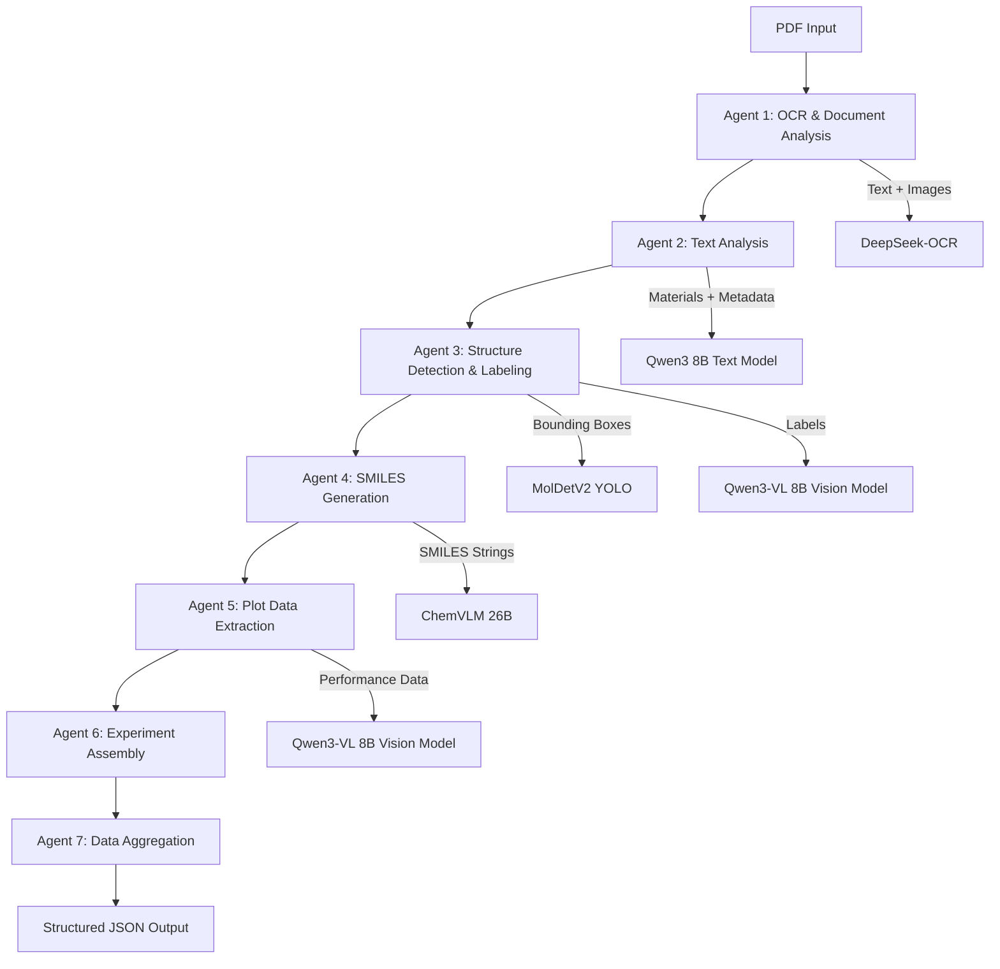

## README.md


# ExMat AI - Automated Battery Material Data Extraction

ExMat AI is an automated pipeline for extracting structured data from battery research papers. The system processes PDF documents and extracts key information including paper metadata, battery materials, chemical structures, SMILES representations, and performance data from plots.

## Overview

Battery materials research papers contain valuable data scattered across text, figures, and tables. Manually extracting this information is time-consuming and error-prone. ExMat AI automates this process using a combination of state-of-the-art AI models for OCR, natural language processing, computer vision, and specialized chemistry models.

## Architecture

The pipeline consists of seven sequential agents, each handling a specific extraction task:



### Detailed Workflow

**Agent 1: OCR & Document Analysis**
- Uses DeepSeek-OCR (vLLM-based) to extract text from all pages
- Converts PDF pages to images using PyMuPDF
- Classifies pages with Qwen3-VL to identify those containing chemical structures and plots
- Output: Full text extraction, annotated page images

**Agent 2: Text Analysis & Material Identification**
- Processes extracted text with Qwen3 8B text model
- Extracts paper metadata (DOI, title, authors, journal, year)
- Identifies all battery materials and their roles (cathode, anode, electrolyte)
- Extracts composition details and processing parameters
- Constructs battery stacks by matching cathode-anode-electrolyte combinations
- Output: Structured material data, battery configurations, processing conditions

**Agent 3: Structure Detection & Labeling**
- Runs MolDetV2 YOLO model on pages identified as containing structures
- Detects bounding boxes around chemical structures
- Expands detection region to capture text labels below or near structures
- Uses Qwen3-VL to read and extract material names from label regions
- Output: Cropped structure images with associated material names

**Agent 4: SMILES Generation**
- Loads ChemVLM 26B model for molecular structure recognition
- Processes each detected structure image through ChemVLM
- Generates SMILES (Simplified Molecular Input Line Entry System) strings
- Validates SMILES strings using RDKit
- Canonicalizes valid SMILES for consistency
- Output: Material name to SMILES mapping with confidence scores

**Agent 5: Plot Data Extraction**
- Classifies plots by type (capacity vs cycle, voltage profile, rate capability)
- Extracts numerical data points from each plot using Qwen3-VL
- Attempts to extract all visible data points for maximum fidelity
- Output: Structured arrays of cycling data and voltage profiles

**Agent 6: Experiment Assembly**
- Matches materials with their corresponding SMILES strings
- Associates performance data with battery stacks
- Creates complete experiment records linking materials, structures, and performance
- Output: Unified experiment objects

**Agent 7: Data Aggregation & Export**
- Compiles all extracted information into a standardized JSON format
- Adds extraction metadata and model information
- Saves to output directory with detailed logging
- Output: Final structured JSON file

## Installation

### Prerequisites

- Ubuntu 20.04 or later
- NVIDIA GPU with CUDA support (tested on A100 40GB)
- Docker and Docker Compose
- Python 3.11
- No sudo access required (uses user-level installations)

### Environment Setup

The system uses three isolated environments:

1. **DeepSeek-OCR Environment** (Python 3.10)
2. **ExMat AI Environment** (Python 3.11)
3. **Ollama Docker Container** (for text and vision models)

#### Step 1: Install uv Package Manager

```
curl -LsSf https://astral.sh/uv/install.sh | sh
source $HOME/.cargo/env
```

#### Step 2: Clone Repository

```
git clone https://github.com/yourusername/ExMatAI.git
cd ExMatAI
```

#### Step 3: Setup Environments

```
chmod +x setup_environments.sh
./setup_environments.sh
```

This script will:
- Create isolated Python environments for DeepSeek-OCR and ExMat AI
- Download and install all required dependencies
- Setup DeepSeek-OCR from the official repository

#### Step 4: Start Ollama Docker Container

```
docker compose up -d
```

Wait for models to download (first run takes 10-15 minutes):

```
docker logs -f ollama-exmatai
```

You should see models being pulled: qwen3:8b, qwen3-vl:8b

#### Step 5: Verify Installation

```
source .venv/bin/activate
python test_ollama_connection.py
```

Expected output:
```
Testing Ollama Connection
================================================================================
Host: http://localhost:11434

Available models:
  - qwen3:8b
  - qwen3-vl:8b

Testing model generation...
Response: Hello from Docker Ollama!

Ollama connection test PASSED!
```

## Project Structure

```
ExMatAI/
├── agents/
│   ├── ocr_agent.py                    # Agent 1: OCR
│   ├── text_analysis_agent.py          # Agent 2: Text extraction
│   ├── structure_extraction_agent.py   # Agent 3: Structure detection
│   ├── smiles_generation_agent.py      # Agent 4: SMILES generation
│   ├── plots_analysis_agent.py         # Agent 5: Plot analysis
│   ├── experiment_assembly_agent.py    # Agent 6: Data matching
│   └── data_aggregation_agent.py       # Agent 7: Final export
├── utils/
│   ├── state_schema.py                 # LangGraph state definition
│   ├── deepseek_ocr_wrapper.py         # DeepSeek-OCR interface
│   ├── chemvlm_wrapper.py              # ChemVLM interface
│   ├── config_manager.py               # Configuration handling
│   └── text_processing.py              # Text utilities
├── workflow/
│   └── langgraph_workflow.py           # LangGraph orchestration
├── DeepSeek-OCR/                       # Isolated OCR environment
├── models/                             # Model cache directory
├── outputs/                            # Extracted JSON results
├── temp/                               # Temporary processing files
├── logs/                               # Execution logs
├── docker-compose.yml                  # Ollama configuration
├── ollama-pull.sh                      # Ollama startup script
├── main.py                             # Entry point
└── requirements.txt                    # Python dependencies
```

## Usage

### Basic Extraction

```
source .venv/bin/activate
python main.py --pdf path/to/paper.pdf
```

### Advanced Options

```
# Enable verbose logging
python main.py --pdf paper.pdf --verbose

# Skip environment checks
python main.py --pdf paper.pdf --skip-check

# Use custom configuration
python main.py --pdf paper.pdf --config custom_config.yaml
```

### Output Format

Results are saved to `outputs/{pdf_name}_extracted.json`:

```
{
  "paper_info": {
    "doi": "10.1016/j.xxx",
    "title": "Paper title",
    "authors": ["Author 1", "Author 2"],
    "journal": "Journal Name",
    "year": 2024
  },
  "materials": {
    "identified_materials": [
      {
        "material_name": "Prussian blue",
        "role": "cathode",
        "chemical_formula": "KFe[Fe(CN)6]"
      }
    ],
    "material_smiles": {
      "Prussian blue": {
        "smiles": "C#N.C#N.C#N.C#N.C#N.C#N.[Fe].[Fe].[K]",
        "page": 2,
        "confidence": 0.95
      }
    }
  },
  "experiments": [
    {
      "experiment_id": 1,
      "materials": {
        "cathode": {"name": "Prussian blue", "formula": "KFe[Fe(CN)6]"},
        "anode": {"name": "PTCDI", "formula": "C24H8N2O8"},
        "electrolyte": [{"name": "KCl", "formula": "KCl"}]
      },
      "smiles": {
        "cathode": "...",
        "anode": "..."
      },
      "processing_conditions": {
        "current_density_mA_g": 400,
        "voltage_range_V": "1.2-3.9",
        "temperature_C": 25,
        "cycle_life": 10000
      },
      "performance_data": {
        "cycling": {
          "data": [
            {"cycle": 1, "capacity_mAh_g": 395},
            {"cycle": 100, "capacity_mAh_g": 385}
          ]
        },
        "voltage_profile": {
          "data": [
            {"capacity_mAh_g": 0, "voltage_V": 3.5},
            {"capacity_mAh_g": 100, "voltage_V": 3.2}
          ]
        }
      }
    }
  ]
}
```

## Models Used

### OCR and Document Processing
- **DeepSeek-OCR**: Multimodal document understanding model based on vLLM
- **PyMuPDF**: PDF to image conversion (no system dependencies)

### Text Analysis
- **Qwen3 8B**: Alibaba's text model for material extraction and metadata parsing
- Runs via Ollama in Docker for easy deployment

### Computer Vision
- **Qwen3-VL 8B**: Vision-language model for image classification and text extraction from figures
- **MolDetV2**: YOLO-based molecular structure detector from UniParser

### Chemistry
- **ChemVLM 26B**: Specialized vision-language model for chemical structure recognition
- **RDKit**: Chemistry toolkit for SMILES validation and canonicalization

### Orchestration
- **LangGraph**: State machine framework for managing the multi-agent pipeline

## Configuration

### Environment Variables

Create a `.env` file:

```
# GPU Configuration
CUDA_VISIBLE_DEVICES=0

# Ollama Configuration
OLLAMA_HOST=http://localhost:11434

# Processing
BATCH_SIZE=1
MAX_WORKERS=4

# Logging
LOG_LEVEL=INFO
DEBUG_MODE=false
```

### Docker Ollama Configuration

Edit `docker-compose.yml` to adjust resources:

```
services:
  ollama:
    image: ollama/ollama:0.13.3-rc1
    network_mode: host
    environment:
      - OLLAMA_HOST=0.0.0.0:11434
      - OLLAMA_ORIGINS=*
    deploy:
      resources:
        reservations:
          devices:
            - driver: nvidia
              count: all
              capabilities: [gpu]
```

### Model Cache Locations

Models are automatically downloaded and cached:

- **Ollama models**: `~/.ollama/models/`
- **HuggingFace models**: `models/chemvlm/`, `models/moldetv2/`
- **DeepSeek-OCR**: `DeepSeek-OCR/.venv/`

## Troubleshooting

### Ollama Connection Failed

```
# Check if container is running
docker ps | grep ollama

# Restart if needed
docker compose restart

# Check logs
docker logs ollama-exmatai

# Test API
curl http://localhost:11434/api/version
```

### ChemVLM Out of Memory

The ChemVLM model requires ~52GB of VRAM. If you encounter OOM errors:

1. Reduce batch size in code
2. Use model quantization (add to chemvlm_wrapper.py)
3. Process structures sequentially instead of in batches

### MolDetV2 Not Detecting Structures

Try adjusting confidence threshold in `structure_extraction_agent.py`:

```
results = model.predict(
    temp_path,
    conf=0.3,  # Lower threshold for more detections
    device=0
)
```

### DeepSeek-OCR Errors

Ensure the isolated environment is activated:

```
cd DeepSeek-OCR
source .venv/bin/activate
python --version  # Should show Python 3.10.x
```

## Performance Notes

Typical processing times on NVIDIA A100 40GB:

- OCR (10 pages): 30-60 seconds
- Text analysis: 5-10 seconds
- Structure detection (6 structures): 20-30 seconds
- SMILES generation: 10-15 seconds per structure
- Plot analysis (6 plots): 40-60 seconds

Total: ~3-5 minutes per paper

## Limitations

- Currently supports English-language papers only
- Structure detection accuracy depends on image quality
- Plot data extraction works best with clear, high-resolution figures
- SMILES generation may fail on complex or unusual structures
- Requires significant GPU memory (32GB+ recommended)

## Development

### Adding New Agents

1. Create agent file in `agents/`
2. Implement agent function with signature: `def agent_name(state: AgentState) -> AgentState`
3. Add node to workflow in `workflow/langgraph_workflow.py`
4. Update state schema in `utils/state_schema.py` if needed


## Acknowledgments

This project builds on several excellent open-source projects:

- DeepSeek-OCR team for the OCR model
- Alibaba Cloud for Qwen3 models
- UniParser team for MolDetV2
- AI4Chem team for ChemVLM
- LangChain team for LangGraph framework

