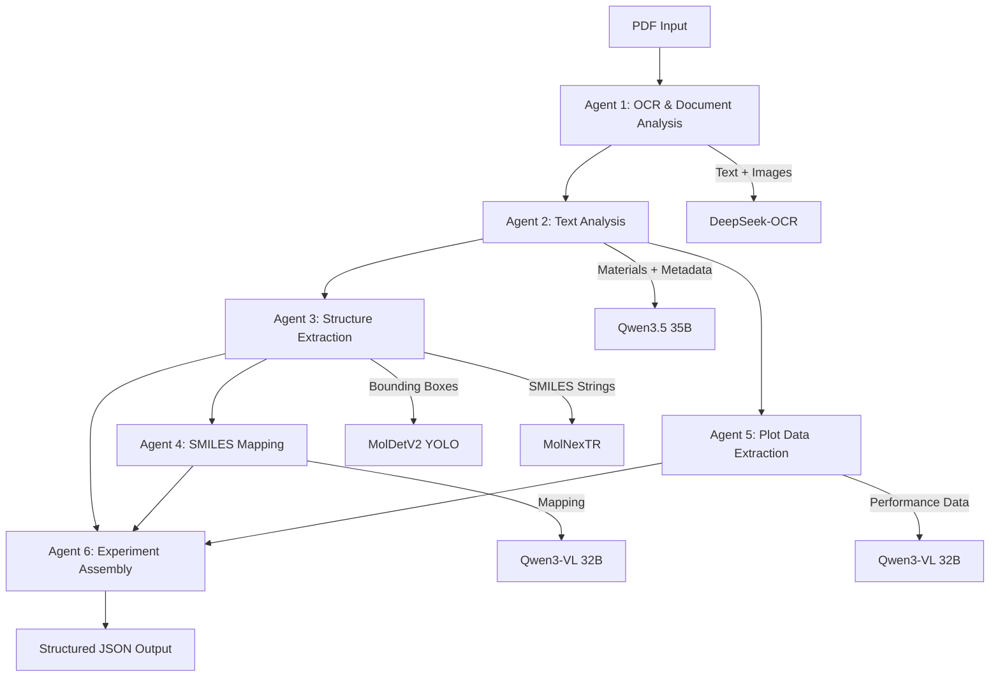

# ExMat AI - Automated Battery Material Data Extraction

ExMat AI is an automated pipeline for extracting structured data from battery research papers. The system processes PDF documents and extracts key information including paper metadata, battery materials, chemical structures, SMILES representations, and performance data from plots.

## Overview

Battery materials research papers contain valuable data scattered across text, figures, and tables. Manually extracting this information is time-consuming and error-prone. ExMat AI automates this process using a combination of state-of-the-art AI models for OCR, natural language processing, computer vision, and specialized chemistry models.

## Architecture

The pipeline consists of six sequential agents, each handling a specific extraction task:



### Detailed Workflow

**Agent 1: OCR & Document Analysis**
- Uses DeepSeek-OCR to extract text from all pages
- Output: Full .mmd text extraction, annotated page images

**Agent 2: Text Analysis**
- Processes extracted text with Qwen3.5 35B
- Extracts paper metadata and materials
- Identifies battery configurations and processing conditions
- Output: Structured material data and experiment conditions

**Agent 3: Structure Extraction**
- Detects bounding boxes around chemical structures using MolDetv2 YOLO
- Generates SMILES strings for cropped structures using MolNexTR
- Validates SMILES strings using RDKit
- Output: Cropped structure images with generated SMILES strings

**Agent 4: SMILES Mapping**
- Uses Qwen3-VL 32B to map detected structures to the text-extracted material names
- Output: Material name to SMILES string mapping

**Agent 5: Plots Analysis**
- Crops sub-panels using `figpanel`
- Extracts numerical data points from capacity and voltage plots using Qwen3-VL 32B
- Output: Structured CSV datasets of cycling data and voltage profiles

**Agent 6: Experiment Assembly**
- Compiles texts, mapped SMILES, and plot data into a standardized JSON format
- Output: Final structured JSON file with extraction metadata

## Installation

### Prerequisites

- Ubuntu 20.04 or later
- NVIDIA GPU with CUDA support (tested on A100 40GB)
- Docker and Docker Compose
- Python 3.11
- No sudo access required (uses user-level installations)

### Environment Setup

The system uses three isolated environments:

1. **DeepSeek-OCR Environment** (Python 3.10)
2. **ExMat AI Environment** (Python 3.11)
3. **Ollama Docker Container** (for text and vision models)

#### Step 1: Install uv Package Manager

```
curl -LsSf https://astral.sh/uv/install.sh | sh
source $HOME/.cargo/env
```

#### Step 2: Clone Repository

```
git clone https://github.com/yourusername/ExMatAI.git
cd ExMatAI
```

#### Step 3: Setup Environments

```
chmod +x setup_environments.sh
./setup_environments.sh
```

This script will:
- Create isolated Python environments for DeepSeek-OCR and ExMat AI
- Download and install all required dependencies
- Setup DeepSeek-OCR from the official repository

#### Step 4: Start Ollama Docker Container

```
docker compose up -d
```

Wait for models to download (first run takes 10-15 minutes):

```
docker logs -f ollama-exmatai
```

You should see models being pulled: qwen3.5:35b, qwen3-vl:32b

#### Step 5: Verify Installation

```
source .venv/bin/activate
python test_ollama_connection.py
```

Expected output:
```
Testing Ollama Connection
================================================================================
Host: http://localhost:11434

Available models:
  - qwen3.5:35b
  - qwen3-vl:32b

Testing model generation...
Response: Hello from Docker Ollama!

Ollama connection test PASSED!
```

## Project Structure

```
ExMatAI/
├── agents/
│   ├── ocr_agent.py                    # Agent 1: OCR
│   ├── text_analysis_agent.py          # Agent 2: Text extraction
│   ├── plots_analysis_agent.py         # Agent 3: Plot analysis
│   ├── structure_extraction_agent.py   # Agent 4: Structure detection
│   ├── smiles_mapping_agent.py         # Agent 5: SMILES mapping
│   ├── experiment_assembly_agent.py    # Agent 6: Final export
│   └── __init__.py                     
├── utils/
│   ├── state_schema.py                 # LangGraph state definition
│   └── __init__.py
├── workflow/
│   └── langgraph_workflow.py           # LangGraph orchestration
├── DeepSeek-OCR/                       # Isolated OCR environment
├── outputs/                            # Extracted JSON results
├── logs/                               # Execution logs
├── docker-compose.yml                  # Ollama configuration
├── ollama-pull.sh                      # Ollama startup script
├── setup_environments.sh               # Environment building script
├── config.yaml                         # Project configuration file
├── main.py                             # Entry point
├── pyproject.toml                      # Project metadata and dependencies
└── requirements.txt                    # Python dependencies
```

## Usage

### Basic Extraction

```
source .venv/bin/activate
python main.py --pdf path/to/paper.pdf
```

### Advanced Options

```
# Enable verbose logging
python main.py --pdf paper.pdf --verbose

# Skip environment checks
python main.py --pdf paper.pdf --skip-check

# Use custom configuration
python main.py --pdf paper.pdf --config custom_config.yaml
```

### Output Format

Results are saved to `outputs/{pdf_name}_extracted.json`:

```json
{
  "paper_name": "nenergy201774",
  "extraction_metadata": {
    "extraction_date": "2026-03-05T19:29:25.398477",
    "pdf_path": "/path/to/sample_papers/nenergy201774.pdf",
    "models_used": {
      "ocr": "DeepSeek-OCR (vLLM)",
      "text_llm": "qwen3.5:35b",
      "vision_llm": "qwen3-vl:32b",
      "structure_detection": "UniParser/MolDetv2",
      "smiles_generation": "MolNexTR"
    },
    "total_experiments": 2,
    "total_smiles_mapped": 1,
    "total_plots_extracted": 2
  },
  "experiments": [
    {
      "Subtype": "Positive",
      "Type_of_battery": "Half-cell",
      "Battery_type": "Lithium-ion",
      "Material_Name_Negative": "Lithium metal",
      "Material_Name_Positive": "diquinoxalinylene (2Q)",
      "wt_percent_active_material": "30",
      "conductive_material": "graphene",
      "wt_percent_conductive_mat": "60",
      "binder": "PVDF",
      "wt_percent_binder": "10",
      "Electrolyte": "1.0 mol L-1 LiTFSI in DOL/DME",
      "Cell_setup": "2016-type coin cell",
      "Temperature": "Ambient temperature",
      "Reported_C_rate": "400 mA g-1 (1C)",
      "Reported_Specific_Capacity": "~372 mAh g-1",
      "Max_Reported_Cycles": 10000,
      "Cycle_Data_Figure": [
        "Fig. 3g"
      ],
      "Voltage_Profile_Figure": [
        "Fig. 3a"
      ],
      "SMILES_Negative": null,
      "SMILES_Positive": "C1=CC2=C(C=C1)N=C(C(=N2)C3=NC4=CC=CC=C4N=C3)C5=NC6=CC=CC=C6N=C5",
      "Cycle_Data": [
        {
          "figure": "Fig. 3g",
          "csv_path": "outputs/nenergy201774/plots/fig3_g_data.csv",
          "axis_metadata": {
            "x_axis_label": "Cycle Number",
            "y_axis_label": "Discharge Capacity (mAh g-1)"
          }
        }
      ],
      "Voltage_Profile_Data": [
        {
          "figure": "Fig. 3a",
          "csv_path": "outputs/nenergy201774/plots/fig3_a_data.csv",
          "axis_metadata": {
            "x_axis_label": "Capacity (mAh g-1)",
            "y_axis_label": "Voltage (V)"
          }
        }
      ]
    }
  ]
}
```

## Models Used

### OCR and Document Processing
- **DeepSeek-OCR**: Multimodal document understanding model based on vLLM
- **PyMuPDF**: PDF to image conversion (no system dependencies)

### Text Analysis
- **Qwen3.5 35B**: Alibaba's text model for material extraction and metadata parsing
- Runs via Ollama in Docker for easy deployment

### Computer Vision
- **Qwen3-VL 32B**: Vision-language model for image classification and text extraction from figures
- **MolDetV2**: YOLO-based molecular structure detector from UniParser

### Chemistry
- **MolNexTR**: Specialized model for chemical structure recognition and SMILES generation
- **RDKit**: Chemistry toolkit for SMILES validation and canonicalization

### Orchestration
- **LangGraph**: State machine framework for managing the multi-agent pipeline

## Configuration

### Environment Variables

Create a `.env` file:

```
# GPU Configuration
CUDA_VISIBLE_DEVICES=0

# Ollama Configuration
OLLAMA_HOST=http://localhost:11434

# Processing
BATCH_SIZE=1
MAX_WORKERS=4

# Logging
LOG_LEVEL=INFO
DEBUG_MODE=false
```

### Docker Ollama Configuration

Edit `docker-compose.yml` to adjust resources:

```
services:
  ollama:
    image: ollama/ollama:0.13.3-rc1
    network_mode: host
    environment:
      - OLLAMA_HOST=0.0.0.0:11434
      - OLLAMA_ORIGINS=*
    deploy:
      resources:
        reservations:
          devices:
            - driver: nvidia
              count: all
              capabilities: [gpu]
```

### Model Cache Locations

Models are automatically downloaded and cached:

- **Ollama models**: `~/.ollama/models/`
- **HuggingFace models**: `models/moldetv2/`
- **DeepSeek-OCR**: `DeepSeek-OCR/.venv/`

## Troubleshooting

### Ollama Connection Failed

```
# Check if container is running
docker ps | grep ollama

# Restart if needed
docker compose restart

# Check logs
docker logs ollama-exmatai

# Test API
curl http://localhost:11434/api/version
```

### MolNexTR Errors

Ensure MolNexTR dependencies are correctly installed via the setup script. Out-of-memory errors are much less likely with MolNexTR compared to older models, but if needed due to system limits, consider reducing batch processing.

### MolDetV2 Not Detecting Structures

Try adjusting confidence threshold in `structure_extraction_agent.py`:

```
results = model.predict(
    temp_path,
    conf=0.3,  # Lower threshold for more detections
    device=0
)
```

### DeepSeek-OCR Errors

Ensure the isolated environment is activated:

```
cd DeepSeek-OCR
source .venv/bin/activate
python --version  # Should show Python 3.10.x
```

## Performance Notes

Typical processing times on NVIDIA A100 40GB:

- OCR (10 pages): 1-2 minutes
- Text analysis (Qwen3.5 35B): 1-2 minutes
- Structure detection & SMILES generation: 10-20 seconds
- Plot analysis: 20-30 seconds per plot
- SMILES Mapping (Vision LLM): ~30 seconds

Total: ~5-10 minutes per paper (depending on the number of plots and structures)

## Limitations

- Currently supports English-language papers only
- Structure detection accuracy depends on image quality
- Plot data extraction works best with clear, high-resolution figures
- SMILES generation may fail on complex or unusual structures
- Requires significant GPU memory (32GB+ recommended)

## Development

### Adding New Agents

1. Create agent file in `agents/`
2. Implement agent function with signature: `def agent_name(state: AgentState) -> AgentState`
3. Add node to workflow in `workflow/langgraph_workflow.py`
4. Update state schema in `utils/state_schema.py` if needed


## Acknowledgments

This project builds on several excellent open-source projects:

- DeepSeek-OCR team for the OCR model
- Alibaba Cloud for Qwen3 models
- UniParser team for MolDetV2
- LangChain team for LangGraph framework
- Plottie team for figpanel model

